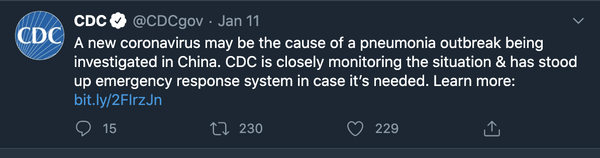

```{r setup, include=FALSE}
library(flexdashboard)
library(tidyverse)
library(skimr)
library(socviz)
library(covdata)
library(coronavirus)
library(janitor)
library(DT)
library(ggthemes)
library(brotools)
library(scales)
library(leaflet)
library(plotly)
library(usmap)
library(spData)
library(ggmap)
library(hrbrthemes)
library(geofacet)
library(gganimate)
library(gifski)
library(rmapshaper)
library(sugarbag)
library(bbplot)
library(ggthemes)
library(Rttf2pt1)
library(extrafontdb)
library(extrafont)
library(covid19R)
library(covdata)
library(coronavirus)
## Global options ----
# chunk options ----
knitr::opts_chunk$set(
  echo = FALSE,
  cache = FALSE,
  prompt = FALSE,
  tidy = FALSE,
  comment = "#> ",
  message = FALSE,
  warning = FALSE, 
  fig.path = "figs/")
# knit options ----
# set theme ----
ggplot2::theme_set(ggthemes::theme_economist_white(base_size = 10, 
                                                   gray_bg = FALSE, 
                                                   horizontal = FALSE,
                                                   base_family = "Ubuntu"))
```

```{r global, include=FALSE}
download.file(url = "https://raw.githubusercontent.com/kjhealy/covdata/master/data-raw/DATASET.R", 
              destfile = "code/DATASET.R")
source("code/get_corona_tscs.R")
coronanet <- get_corona_tscs()
covid19us <- covid19R::get_covid19_dataset(dataset = "covid19us")
```

### January 11th, 2020

#### CDC [tweets](https://twitter.com/CDCgov/status/1216070299877330945?s=20) about a pneumonia outbreak in China possibly being 'a new coronavirus'



#### The link in the tweet now redirects to a standard CDC landing page, but we now know that the CDC announced the first patient testing positive for COVID-19 arrived in Washington on January 15th.

***

### January 29th, 2020 

#### The [Press Secretary announces the President’s Coronavirus Task Force](https://www.whitehouse.gov/briefings-statements/statement-press-secretary-regarding-presidents-coronavirus-task-force/), and states it's purpose on their website:

> "*The Task Force will lead the Administration’s efforts to monitor, contain, and mitigate the spread of the virus, while ensuring that the American people have the most accurate and up-to-date health and travel information.*"

{width=80%}


***

### March 11th, 2020 

#### The World Health Organization [announces COVID-19 is a pandemic](https://twitter.com/WHO/status/1237777021742338049?s=20)

***

#### Things are getting bad, and not enough people are paying attention, 

> "*WHO has been assessing this outbreak around the clock and we are deeply concerned both by the alarming levels of spread and severity, and by the alarming levels of inaction*" - Dr. Tedros Adhanom Ghebreyesus, Director-General of the World Health Organization

***


***

### March 13th, 2020

#### US declares public health emergency

```{r whitehouse-covid-public-health-emergency, out.height="100%", out.width="70%", echo = FALSE}
# another example of this would be, 
# knitr::include_graphics(path = "figs/whitehouse-covid-public-health-emergency.png")
```


{width=70%}

#### The proclamation is [published on the website](https://www.whitehouse.gov/presidential-actions/proclamation-declaring-national-emergency-concerning-novel-coronavirus-disease-covid-19-outbreak/) on March 13th, but the document states the national emergency began on March 1.

> "*NOW, THEREFORE, I, DONALD J. TRUMP, President of the United States, by the authority vested in me by the Constitution and the laws of the United States of America, including sections 201 and 301 of the National Emergencies Act (50 U.S.C. 1601 et seq.) and consistent with section 1135 of the Social Security Act (SSA), as amended (42 U.S.C. 1320b-5), do hereby find and proclaim that the COVID-19 outbreak in the United States constitutes a national emergency, beginning March 1, 2020.*

***

### April, 2020

#### The initial US COVID-19 data were collected as part of CDC's [public health surveillance system](https://www.cdc.gov/coronavirus/2019-ncov/covid-data/faq-surveillance.html#Understanding-the-Data). This was expanded to include probable cases and deaths.


***

##### Data collection is a regular part of [CDCs Public Health Surveillance Program](https://www.cdc.gov/publichealth101/surveillance.html),  

> "*which is the ongoing, systematic collection, analysis, and interpretation of health-related data essential to planning, implementation, and evaluation of public health practice.*"

##### Unfortunately, when the CDC changed it's guidelines in April, not all health departments reported probable deaths and probable infections. See [this Washington Post article](https://www.washingtonpost.com/local/johns-hopkins-tracker/2020/06/29/daea7eea-a03f-11ea-9590-1858a893bd59_story.html),   

> "*The Centers for Disease Control and Prevention had just changed its guidance, suggesting that local health officials include probable deaths and probable infections in their counts. Some states did. Some didn't. Sometimes some counties within a state would follow it and others would chart a different course.*" 

***

### May 2020 

#### The CDC data is criticized for conflating viral and antibody tests in [this Atlantic article](https://www.theatlantic.com/health/archive/2020/05/cdc-and-states-are-misreporting-covid-19-test-data-pennsylvania-georgia-texas/611935/),  

> "*A negative test result means something different for each test. If somebody tests negative on a viral test, a doctor can be relatively confident that they are not sick right now; if somebody tests negative on an antibody test, they have probably never been infected with or exposed to the coronavirus. (Or they may have been given a false result—antibody tests are notoriously less accurate on an individual level than viral tests.) The problem is that the CDC is clumping negative results from both tests together in its public reporting.*"  
 
{width=100%}
 

#### Media/Journalism outlets begin collecting data. 'Excess/missing deaths' are also tracked by [New York Times](https://www.nytimes.com/interactive/2020/04/21/world/coronavirus-missing-deaths.html) and [The Economist](https://www.economist.com/graphic-detail/2020/07/15/tracking-covid-19-excess-deaths-across-countries). 

#### The Atlantic's [COVID tracking project](https://covidtracking.com/about) actually started in March, but projects are updated daily or weekly. 

***

### Where are the data now?

#### Johns Hopkins' Center for Systems Science and Engineering, The New York Times, The Atlantic, and The Economist each begin collecting and sharing data. All data sources are available on Github as `.csv`/`.tsv` files, or for direct download

{width=70%}

 - Johns Hopkins' Center for Systems Science and Engineering (CSSE) [COVID-19 Data Repository](https://github.com/CSSEGISandData/COVID-19) compiles many of the data sources in the R packages

 - The New York Times and The Economist each created their own COVID-19 data tracking systems, and each have their respective data repository ([NYT](https://github.com/nytimes/covid-19-data) and [TheEconomist](https://github.com/TheEconomist/covid-19-excess-deaths-tracker)).

 - The Atlantic create [The COVID tracking project](https://covidtracking.com/data) in March with datasets for direct download.

***

### R specific packages for COVID-19 data 

#### R ([the programming language and free software environment](https://en.wikipedia.org/wiki/R_(programming_language)) for statistical computing and graphics), has a global network of users who created numerous packages for accessing COVID-19 data. 

#### New packages are being released all the time, so we'll only cover three of these packages:

{width=100%}


- [`covid19R`](https://github.com/Covid19R/covid19R) 

- [`covdata`](https://kjhealy.github.io/covdata/)  

- [`coronavirus`](https://ramikrispin.github.io/coronavirus/)


***

### covid19R: a one-stop shop for documented, tidy COVID-19 data

#### Load COVID-19 data from `covid19R` with the `covid19R::get_covid19_dataset()` function. 

The [`covid19R`](https://github.com/Covid19R/covid19R) package attempts to provide complete "*a single package that allows users to access all of the tidy covid-19 datasets collected by data packages that implement the `covid19R` tidy data standard*"

For a complete list of the available data, use `covid19R::get_covid19_data_info()`

```{r get_covid19_data_info, echo=TRUE, eval=FALSE}
# check datasets in each package ----
covid19R::get_covid19_data_info()
```
```{r get_covid19_data_info-paged_table, echo=FALSE}
rmarkdown::paged_table(
covid19R::get_covid19_data_info())
```

***

### covdata: a collection of COVID data from multiple sources, all in tidy `tibbles`

#### The table below displays the name of each dataset and it's description.

The `Item` is the dataset, the `Title` is the description.

```{r paged_table-CovdataDatasets, echo=FALSE}
CovdataDatasets <- datasets.load::datasets('covdata')
rmarkdown::paged_table(
dplyr::select(CovdataDatasets, -Package))
```

+ Check out the [package website](https://kjhealy.github.io/covdata/)

- `covdata` includes a couple handy datasets, like **`uspop`**, which has the `State population estimates for US States`, and **`countries`**, which has the `Country Names and ISO codes`.

- Also imports the handy ``%nin%`()` function (for 'not in').

***

### coronavirus: a small and efficient package  

#### The [`update_dataset()`](https://ramikrispin.github.io/coronavirus/reference/update_dataset.html) function gets a fresh `coronavirus` dataset

[`coronavirus`](https://ramikrispin.github.io/coronavirus/index.html) contains a single dataset from the Johns Hopkins University Center for Systems Science and Engineering (JHU CCSE) repository. 

```{r update_dataset, echo=TRUE, eval=FALSE}
library(coronavirus)
coronavirus::update_dataset()
coronavirus::coronavirus
```

```{r coronavirus-paged_table, echo=FALSE}
coronavirus <- coronavirus::coronavirus
rmarkdown::paged_table(coronavirus)
```

***

- Check out the [data sources](https://ramikrispin.github.io/coronavirus/#data-sources) section for more details about any updates to the `coronavirus` data in this package.

